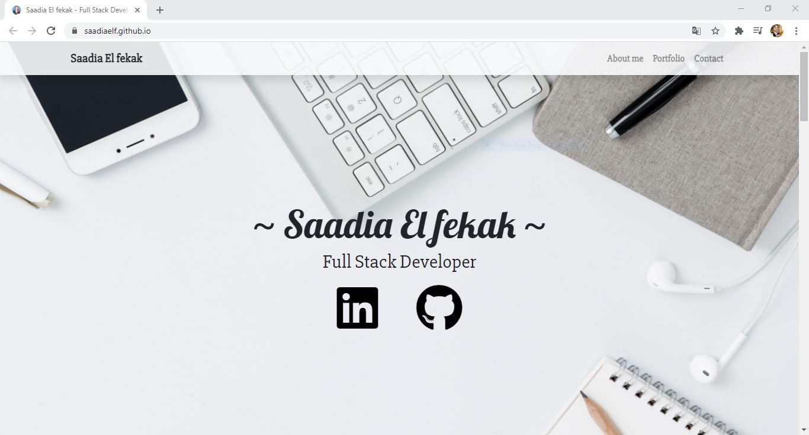
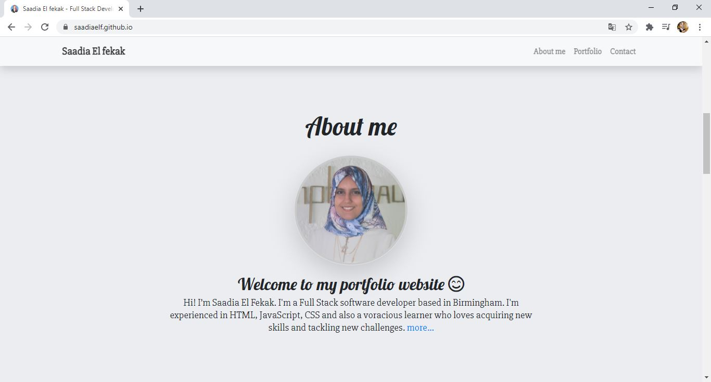
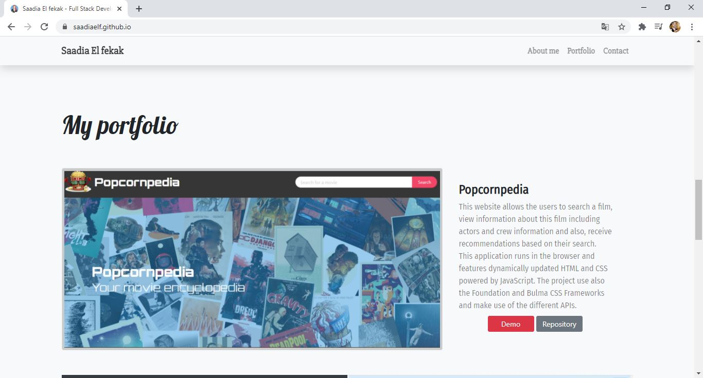
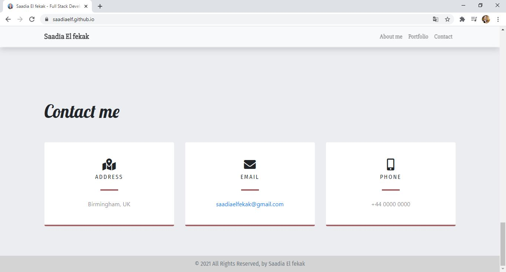
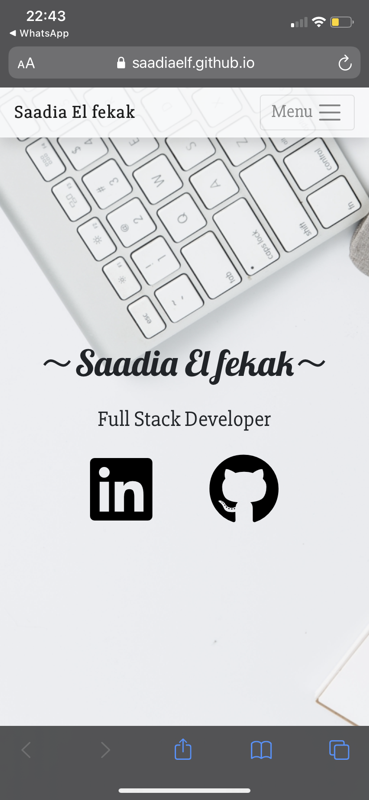
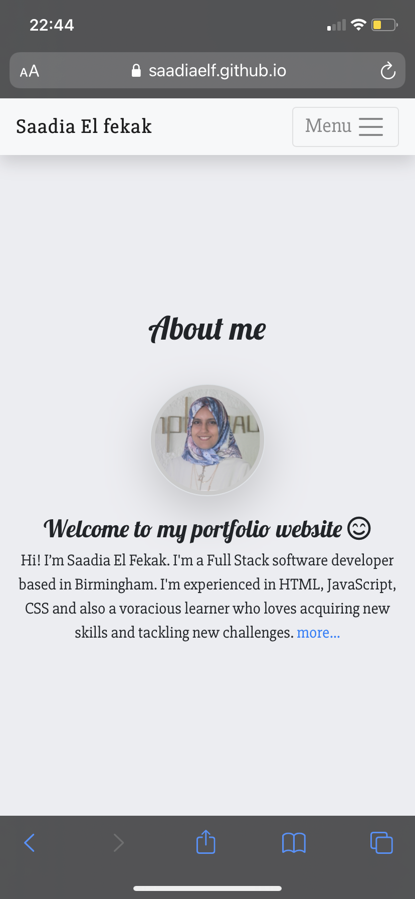
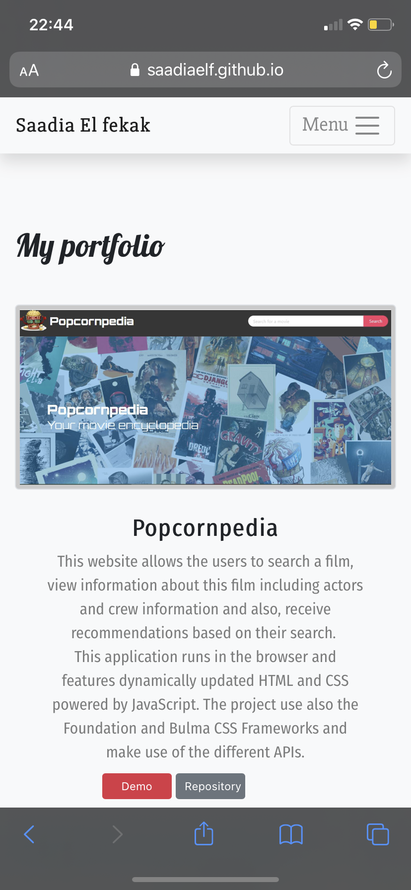
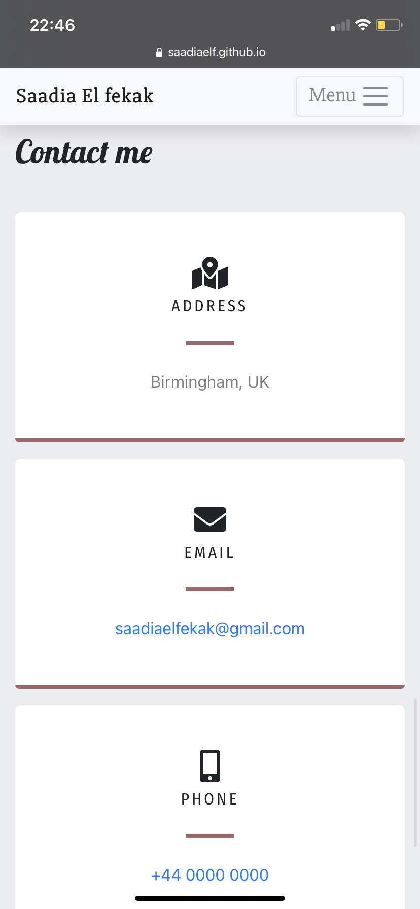

# Portfolio_SEF  
-----------------------------------------------------------------------------------------------------------------------
Table of content :

* [Purpose](#Purpose)
* [Method](#Method)
* [HTML file](#HTML-file)
* [CSS file](#CSS-file) 
* [Bootsrap framework](#Bootsrap-framework) 
* [JQuery file](#JQuery-file) 
* [Demonstration](#Demonstration)
* [URLs](#URLs) 

-----------------------------------------------------------------------------------------------------------------------

## Purpose :

The main purpose of this project is to build an updated portfolio that will run in the browser and feature dynamically updated HTML and CSS .

-----------------------------------------------------------------------------------------------------------------------

## Method : 

    This website is created using the following languages, libraries and software.

    * HTML files : index.html.
    * JQuery file: script.js
    * CSS file : style.css
    * Bootstrap framework
    * VS Code
    * Github
   
-----------------------------------------------------------------------------------------------------------------------

## HTML file : 
    
    This file is created according to the standards.

    * Using sementics
    * Using consistently indentation and spacing
    * Using links to link the HTML file to other files (CSS and JQuery files)
    * Using external links to link the HTML file to Bootstrap, Font Awesome, Google Fonts and JQuery
    * Commenting the code
-----------------------------------------------------------------------------------------------------------------------

## CSS file : 

This file is used to personalise the styles by creating new classes and ids.

    The main CSS properties used in this website are :
    
    * Font : font-size, font-family, font-weight
    * Margin :  margin, margin-top, margin-bottom
    * Padding : padding, padding-top, padding-bottom
    * Border : border, border-bottom, border-width, border-color
    * background : .background-image, .background-position, .background-repeat, .background-attachment, .background-size, .background-color 
    * Position
    * Height
    * Width
    * Scroll-behavior
    * media query
-----------------------------------------------------------------------------------------------------------------------

## Bootsrap framework : 

This open-source framework is used to style the website and make it reponsive. 

    The main Bootsrap components used in this website are :

    * Grid-system : container, rows and columns (.container, .row, .col)
    * Responsive grid: .col-lg, .col-xl, .col-md
    * Margin and padding : .m, .p, .ms, .mt, .me, .mb
    * Navigation bar : .navbar, .navbar-brand, .navbar-collapse, .navbar-toggler,
    * Card : .card, .card-body
    * Button : .btn, .btn-danger, .btn-secondary, .btn-sm

-----------------------------------------------------------------------------------------------------------------------

## JQuery file : 

This file is used to create a dynamic website using functions to create a simple calendar.

    The main JQuery properties and methods used in this website are :
    
    * HTML DOM :  .on() Method, .collapse() Method

-----------------------------------------------------------------------------------------------------------------------

## Demonstration :
Desktop screenshots :

Mobile screenshots :
 

-----------------------------------------------------------------------------------------------------------------------

## URLs

* The URL of the deployed application : "https://saadiaelf.github.io/Portfolio_SEF/"

* The URL of the GitHub repository: https://github.com/SaadiaELF/Portfolio_SEF.git

-----------------------------------------------------------------------------------------------------------------------
